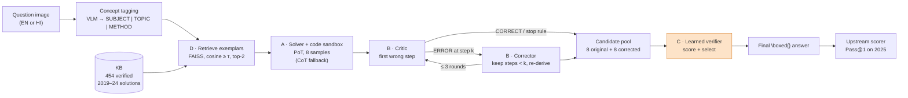
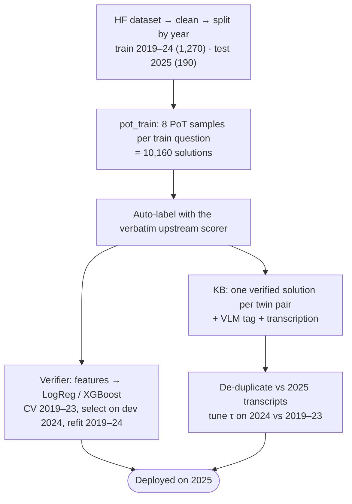
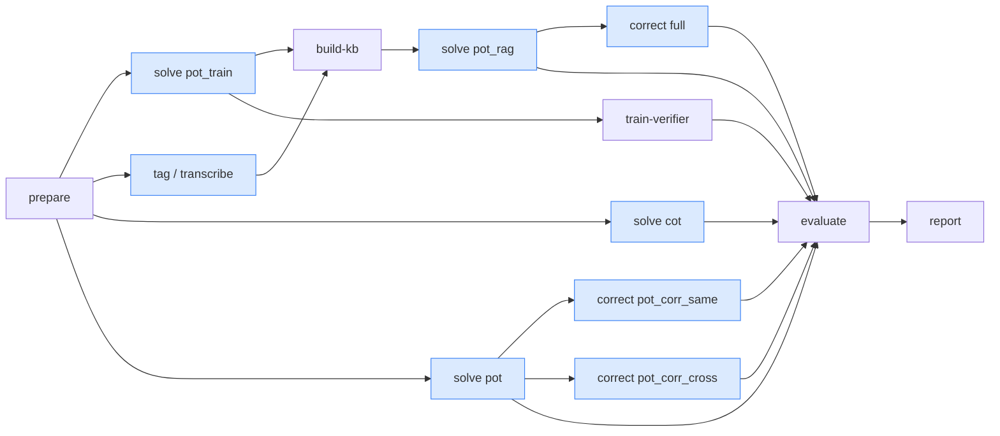
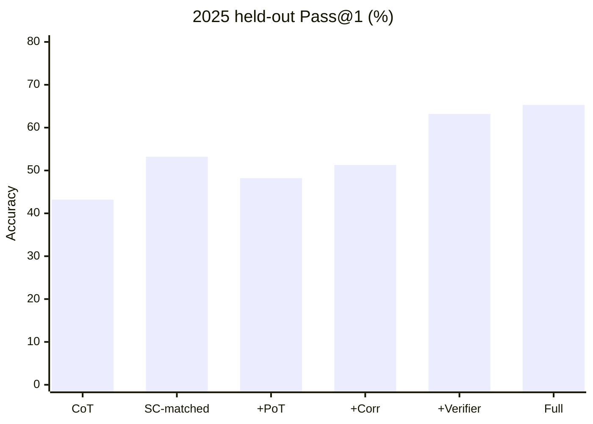

# mmJEE-Reasoner: improving scientific reasoning in VLMs on mmJEE-Eval

**Team Erdős**, IIT Bhilai, Machine Learning course project

> *Improving Scientific Reasoning in Vision-Language Models using Code Sandboxes, Agentic
> Correction, Learned Verification, and RAG on mmJEE-Eval*: an inference-time framework that
> wraps a **frozen** vision-language model and is evaluated on the
> [mmJEE-Eval](https://mmjee-eval.github.io) benchmark (JEE Advanced, English + Hindi,
> question images).

| Member | Roll no. | Email | GitHub |
|---|---|---|---|
| Arpit Kumar | 12340350 | arpitk@iitbhilai.ac.in | [@arpitkumar0007](https://github.com/arpitkumar0007) |
| Saurav Gupta | 12341940 | sauravg@iitbhilai.ac.in | [@Saurav1375](https://github.com/Saurav1375) |

**Headline (2025 held-out, 190 questions, Qwen3-VL-8B AWQ):**

| Setup | Accuracy |
|---|---|
| Baseline single-pass CoT | 43.2% |
| Self-consistency at **matched compute** | 53.2% |
| **Full framework** | **65.3%** |

Full framework vs. matched self-consistency: **+12.1 points** [+4.2, +20.5], McNemar p = 0.001.

---

## Contents

1. [Project phases and branches](#1-project-phases-and-branches)
2. [Problem statement](#2-problem-statement)
3. [Team contributions](#3-team-contributions)
4. [Pipeline overview](#4-pipeline-overview)
5. [Setup](#5-setup)
6. [Running the pipeline](#6-running-the-pipeline)
7. [Specifications](#7-specifications)
8. [Results (Phase 2)](#8-results-phase-2)
9. [Directory structure](#9-directory-structure)
10. [Experimental protocol and safeguards](#10-experimental-protocol-and-safeguards)
11. [References](#11-references)

---

## 1. Project phases and branches

| Phase | Branch | Content | Notes |
|---|---|---|---|
| **1. Proposal and base-paper study** | [`phase-1`](../../tree/phase-1) | SOP, base-paper repo (submodule), code audit | [`docs/phases/PHASE1.md`](docs/phases/PHASE1.md) |
| **2. Baselines, pilot, full run (v2)** | [`phase-2`](../../tree/phase-2) | Framework implementation; Qwen2.5-VL-7B reproduction and Qwen3-VL-8B baselines; 40-question pilot; v1→v2 fixes; full 2025 run; reports | [`docs/phases/PHASE2.md`](docs/phases/PHASE2.md) |
| 3. v3 improvements | `phase-3` | In progress (not yet published): clean 2026 test, Qwen2.5 bridge to the paper, memorisation probes, verifier v3 with correction gate, RAG v3 | — |

`main` always points to the latest published phase, which is currently **phase 2**. Each
phase document lists its goals, the issues encountered, and the future enhancements.

## 2. Problem statement

[mmJEE-Eval](https://arxiv.org/abs/2511.09339) (Mukherjee & Ghosh, Findings of IJCNLP-AACL
2025) tests 17 VLMs on **1,460 bilingual JEE Advanced questions** from 2019–2025 (Physics,
Chemistry, Mathematics), each given as an image. It reports three findings:
- **a capability gap:** frontier models reach 77–84% on the held-out 2025 set, while open models reach 37–45%;
- **contamination is not the explanation:** scores stay roughly stable on the unseen 2025 set;
- **a metacognition gap:** models *detect* errors in their own reasoning in 21–73% of cases, but *fix* only 1.1–5.2%, and correction is evaluated in a single pass.

The paper is diagnostic: it measures these weaknesses but does not try to reduce them.
**Our goal** is to improve Pass@1 of an open VLM *without training it*. We use a modular,
inference-time framework, evaluated on the contamination-clean 2025 held-out set, and compare
it fairly against self-consistency at matched compute.

| Module | Weakness addressed | Approach |
|---|---|---|
| **A. Code-sandbox tool use** | Numerical questions (44.7%) need reliable arithmetic | Program-of-Thoughts: every calculation is executed Python/SymPy in a sandbox; CoT fallback |
| **B. Agentic iterative correction** | Detect-vs-fix gap; single-pass correction | Solver → Critic (locates the *first* wrong step) → Corrector (re-derives from it), ≤3 rounds |
| **C. Learned solution verifier** *(core ML)* | Self-selection is unreliable; correction can break right answers | LogReg/XGBoost trained on 10k auto-labelled 2019–2024 solutions; best-of-N selection |
| **D. Retrieval-augmented exemplars** | Weak models choose the wrong *method* | Concept tag → FAISS search over verified 2019–2024 solutions → top-2 worked examples above a tuned threshold |

Only the verifier is trained.

## 3. Team contributions

From the SOP (§I, "Team composition and individual contributions"):

- **Arpit Kumar (12340350):** responsible for the **Retrieval-Augmented Exemplar Prompting** module (knowledge-base construction, retrieval, and exemplar injection).
- **Saurav Gupta (12341940):** responsible for the **Agentic Iterative Correction** module (Solver/Critic/Corrector orchestration).
- **Both members (shared work):** the **Code-Sandbox Tool Use** module and the **Learned Solution Verifier** (the core ML component), including data generation, feature design, training and evaluation.

Code ownership in this repository follows that split:

| Area | Code | Committed by |
|---|---|---|
| Module D: RAG | `src/mmjee_reasoner/rag/`, `configs/experiments/pot_rag.yaml`, `tests/test_rag.py` | Arpit Kumar |
| Module A: Code sandbox (shared) | `src/mmjee_reasoner/sandbox/`, `configs/experiments/pot.yaml`, `tests/test_sandbox.py` | Arpit Kumar |
| Module B: Agentic correction | `src/mmjee_reasoner/agents/`, `configs/experiments/pot_corr_*.yaml`, `tests/test_agents.py` | Saurav Gupta |
| Module C: Learned verifier (shared) | `src/mmjee_reasoner/verifier/`, `configs/experiments/{pot,cot}_train.yaml`, `tests/test_verifier.py` | Saurav Gupta |
| Harness and infrastructure | data, scoring, llm, prompts, pipeline, report, CLI, lab scripts, docs | Saurav Gupta |

## 4. Pipeline overview

### 4.1 Inference pipeline (per test question)



### 4.2 Training and build (2019–2024 only, no test data)



### 4.3 Stage graph (what runs where)



Blue stages run on the GPU (vLLM). The others run on a CPU. Each module and stage is documented
in detail in its own README:

| Stage | README |
|---|---|
| Data | [`data/`](src/mmjee_reasoner/data/README.md) |
| Scoring | [`scoring/`](src/mmjee_reasoner/scoring/README.md) |
| Inference engine | [`llm/`](src/mmjee_reasoner/llm/README.md) |
| Prompts | [`prompts/`](src/mmjee_reasoner/prompts/README.md) |
| Module A: sandbox | [`sandbox/`](src/mmjee_reasoner/sandbox/README.md) |
| Module B: agents | [`agents/`](src/mmjee_reasoner/agents/README.md) |
| Module C: verifier | [`verifier/`](src/mmjee_reasoner/verifier/README.md) |
| Module D: RAG | [`rag/`](src/mmjee_reasoner/rag/README.md) |
| Pipeline stages | [`pipeline/`](src/mmjee_reasoner/pipeline/README.md) |
| Reports | [`report/`](src/mmjee_reasoner/report/README.md) |
| Configs | [`configs/`](configs/README.md) |
| Scripts | [`scripts/`](scripts/README.md) |
| Tests | [`tests/`](tests/README.md) |

## 5. Setup

### 5.1 Clone (with the base-paper submodule)

```bash
git clone --recurse-submodules https://github.com/Saurav1375/erdos-mmjee-reasoner.git
cd erdos-mmjee-reasoner
# existing clone: git submodule update --init
```

`third_party/mmJEE-Eval` is the base paper's repository, pinned at `815ac89`. It is needed
only to re-verify the vendored scoring code (`tests/test_scoring.py`,
`scripts/vendor_upstream.py`).

### 5.2 CPU / development environment

Use this for data, tests, verifier, KB, evaluation and reports. Requirements: Python 3.12 and
[uv](https://docs.astral.sh/uv/).

```bash
uv venv --python 3.12 .venv
uv pip install --python .venv/bin/python --torch-backend cpu -r requirements.txt
uv pip install --python .venv/bin/python --no-deps -e .
source .venv/bin/activate
pytest                              # 73 tests, CPU only, ~2 min (fake VLM)
```

Plain pip works too: `pip install -r requirements.txt --extra-index-url https://download.pytorch.org/whl/cpu && pip install --no-deps -e .`

### 5.3 GPU environment (model generation with vLLM)

On a CUDA machine with at least 12 GB of VRAM:

```bash
uv venv --python 3.12 .venv
uv pip install --python .venv/bin/python -r requirements-gpu.txt
uv pip install --python .venv/bin/python -e ".[dev]"
```

On our lab PC this is automated over ssh: `scripts/lab/setup_lab.sh` (see
[`scripts/README.md`](scripts/README.md); host and paths are set in `scripts/lab/env.sh`).
Model weights download from Hugging Face on first use (about 6–7 GB per 4-bit model).

## 6. Running the pipeline

`mmjee` = `python -m mmjee_reasoner`.

- **Global option:** `--config <yaml>` (repeatable overrides, before the stage name).
- **Stage options:** `--limit N` (random smoke subset), `--pilot` (fixed 40-question subset) and `--mock` (fake VLM, writes to `artifacts_mock/`).
- `mmjee status` lists what already exists.

| # | Command | Where | Produces |
|---|---|---|---|
| 0 | `mmjee prepare` | either | `artifacts/data/` (images, `questions.parquet`, split report) |
| 1 | `mmjee solve --exp pot_train` | GPU | 8 PoT samples × 1,270 train questions (verifier data + KB solutions) |
| 2 | `mmjee tag` and `mmjee transcribe` | GPU | concept tags and transcriptions (`artifacts/rag/`) |
| 3 | `mmjee solve --exp cot` | GPU | 20 baseline CoT samples × 190 test questions |
| 4 | `mmjee solve --exp pot` | GPU | 8 PoT samples × 190 |
| 5 | `mmjee build-kb` | either | KB + FAISS index + tuned threshold (`artifacts/rag/kb/`) |
| 6 | `mmjee solve --exp pot_rag` | GPU | 8 RAG-PoT samples × 190 |
| 7 | `mmjee correct --exp pot_corr_same` / `pot_corr_cross` / `full` | GPU | correction chains + corrected candidates |
| 8 | `mmjee train-verifier` | either | `artifacts/verifier/` (models, `report.json`) |
| 9 | `mmjee evaluate` | either | `artifacts/eval/results.json`, `per_question.csv` |
| 10 | `mmjee report` | either | `report/REPORT.md`, `report/figures/`, `report/latex/` |
| — | `mmjee solve --exp repro_qwen25`; `mmjee solve --exp cot_train` | GPU | reproduction check; contamination check |

Every model call and code execution is cached in `artifacts/cache/generations.sqlite`, so
every stage can be **resumed**: re-running computes only what is missing.

Without a GPU, `tests/test_pipeline_e2e.py` runs the whole pipeline
(solve → correct → verifier → evaluate) on the fake VLM. After `mmjee prepare`, any stage can
also run with `--mock`, e.g. `mmjee solve --exp pot --limit 6 --mock`.

## 7. Specifications

Full details: [`docs/SPECIFICATIONS.md`](docs/SPECIFICATIONS.md).

| | |
|---|---|
| GPU machine | NVIDIA RTX 3060 **12 GB**, Intel i7-13700, 15 GB RAM, Ubuntu 24.04, Python 3.12.3, vLLM 0.30.0, torch 2.13.0 |
| Solver VLM | `cyankiwi/Qwen3-VL-8B-Instruct-AWQ-4bit` (frozen) |
| Cross-model critic | `cyankiwi/InternVL3_5-8B-AWQ-4bit` |
| Reproduction model | `Qwen/Qwen2.5-VL-7B-Instruct-AWQ` |
| Embeddings | `BAAI/bge-small-en-v1.5` (verifier + RAG), FAISS `IndexFlatIP` |
| vLLM | max_model_len 12,288, fp8 KV cache (auto for Qwen2.5), gpu_mem 0.88, 32 seqs, 4,096 batched tokens, ≤1.7 MP images |
| Sampling | T 0.7, top-p 0.8, top-k 20, **max 4,096 tokens** per trajectory |
| Samples | CoT 20 · PoT / RAG-PoT / pot_train 8 · repro 10 |
| Sandbox | 10 s, 1 GB, ≤3 code blocks, whitelisted imports |
| Correction | ≤3 rounds, patience 2, greedy critic ≤1,536 tokens |
| Verifier | LogReg / XGBoost × {handcrafted, embedding, all}; GroupKFold-5; dev 2024 |
| RAG | top-2, τ = 0.885 (auto), dedup 0.90 |
| Compute | ~54 GPU-hours for the full run |

## 8. Results (Phase 2)

All numbers are on the **2025 held-out set** (190 questions = 95 EN + 95 HI). 95% CIs come from
a cluster bootstrap over EN/HI twin pairs. Raw outputs are in [`results/phase2/`](results/phase2).

### 8.1 SOP Table I

| Configuration | Overall Pass@1 | Numerical | 95% CI | Tokens / q |
|---|---|---|---|---|
| Baseline (single-pass CoT) | 43.2 | 40.2 | 37.0–49.6 | 2.7k |
| Self-consistency (matched compute, n = 20) | 53.2 | 51.2 | 44.2–62.6 | 54.2k |
| + Code sandbox (PoT) | 48.2 | 50.4 | 41.4–54.9 | 3.5k |
| + Agentic correction (same-model critic) | 51.2 | 55.1 | 44.6–58.0 | 6.1k |
| + Agentic correction (cross-model critic) | 51.3 | 53.0 | 44.5–58.1 | 6.4k |
| + Learned verifier | 63.2 | 66.7 | 55.3–71.6 | 51.5k |
| **+ Retrieval (RAG) = Full framework** | **65.3** | **69.0** | 57.4–73.7 | 54.1k |



### 8.2 Significance and analyses

| Analysis | Result |
|---|---|
| Full vs. matched self-consistency | **+12.1 [+4.2, +20.5]**; McNemar p = 0.001 (35 vs 12 discordant questions) |
| PoT vs. CoT | +5.0, p = 0.012 |
| Correction step | +3.2 [+1.3, +5.0] |
| Verifier step | +11.8 [+6.8, +16.6] |
| RAG step | +2.1 [−3.2, +6.8], not significant |
| Correction (1,520 chains/run) | detection 58–61%, false alarms 19–29%; **14–19% of detected errors fixed** vs the paper's single-pass 1.1–5.2% |
| Verifier | 10,160 training solutions; dev AUC 0.915; 2025 AUC 0.836 (LogReg) / 0.882 (XGBoost). On 2025 the selector ≈ majority vote (65.3 vs 65.8; oracle 85.3), so the gain comes mainly from the diverse candidate pool |
| RAG | 454 KB entries; only 30/190 test questions retrieve exemplars; on those, PoT 30.0 → 37.9 |
| Reproduction | Qwen2.5-VL-7B: **13.8 ± 1.9** vs the paper's 12.4 ± 1.9, so the harness is validated |
| Contamination | 1 CoT sample: 43.9% (2019–24) vs 42.6% (2025); no memorisation signal |
| Breakdown | EN–HI gap widens 9.8 → 16.9; diagram gap 18.5 → 26.3; gains come from reasoning and computation, not perception |

Reports:
- Phase-2 progress report: [`report/phase2/phase2_report.pdf`](report/phase2/phase2_report.pdf) ([Markdown](report/PHASE2_REPORT.md));
- final-report draft: [`report/final/final_report.pdf`](report/final/final_report.pdf);
- auto-generated summary: [`report/REPORT.md`](report/REPORT.md).

## 9. Directory structure

```
erdos-mmjee-reasoner/
├── README.md                     # this file
├── requirements.txt              # exact CPU/dev versions
├── requirements-gpu.txt          # exact lab GPU versions (vLLM)
├── pyproject.toml  uv.lock  .python-version
├── configs/                      # YAML configs                                  → configs/README.md
│   ├── base.yaml                 #   paths, split, sampling, module settings, Table I
│   ├── models.yaml               #   model roles + vLLM settings
│   └── experiments/*.yaml        #   one file per generation run
├── src/mmjee_reasoner/
│   ├── cli.py  __main__.py       # `python -m mmjee_reasoner <stage>`
│   ├── config.py  embed.py       # config loader; sentence-embedding helper
│   ├── data/                     # dataset download, cleaning, split, scorer adapter
│   ├── scoring/                  # upstream.py = VERBATIM base-paper scorer; metrics
│   ├── llm/                      # vLLM engine, SQLite generation cache, fake VLM
│   ├── prompts/                  # all prompts (baseline prompts verbatim from the paper)
│   ├── sandbox/                  # Module A: code executor + PoT loop
│   ├── agents/                   # Module B: steps, critic, corrector loop
│   ├── verifier/                 # Module C: features, models, training/selection
│   ├── rag/                      # Module D: tagger, knowledge base, retrieval
│   ├── pipeline/                 # stages: solve, correct, evaluate
│   └── report/                   # REPORT.md / LaTeX / figure builder
├── scripts/
│   ├── vendor_upstream.py        # regenerate scoring/upstream.py from the notebooks
│   ├── phase2_report.py  final_report.py
│   └── lab/                      # lab GPU setup, launch, supervise, sync
├── tests/                        # 73 pytest tests (CPU, fake VLM)
├── results/phase2/               # published result summaries (JSON/CSV)
├── report/                       # Phase-2 report, final-report draft, generated report
├── docs/
│   ├── proposal/SOP_12340350_12341940.pdf
│   ├── phases/PHASE1.md  PHASE2.md
│   ├── SPECIFICATIONS.md
│   └── REFERENCES.md
├── third_party/mmJEE-Eval/       # base-paper repo (git submodule @ 815ac89)
└── artifacts/                    # generated at runtime (git-ignored)
```

## 10. Experimental protocol and safeguards

- **Split by year.** Train/dev 2019–2024, test 2025. English/Hindi versions share a *twin key*, which groups splits, CV folds and KB entries. Assertions check split sizes and disjointness.
- **No test data in any choice.** The verifier model, feature set, selection rule, τ and the KB are all chosen with 2019–2024 data only. 2025 metrics are reported, never used.
- **Verbatim scoring.** `scoring/upstream.py` holds byte-identical copies of the base-paper functions, and a test re-checks identity against the submodule. Missing scorer columns are rebuilt on the data side (`data/adapter.py`).
- **Fair comparison.** Self-consistency gets the same generated-token budget as the full framework.
- **Leakage control.** The KB uses 2019–2024 only and is de-duplicated against 2025 transcriptions (cosine ≥ 0.90).
- **Sandbox safety.** Static AST whitelist, an isolated `python -I` subprocess, CPU/memory/file limits, and a wall-clock timeout that kills the process group.
- **Reproducibility.** Derived seeds, a full generation cache, and offline evaluation and reports.

## 11. References

The full list, with the exact code locations that use each reference, is in
[`docs/REFERENCES.md`](docs/REFERENCES.md).

1. A. Mukherjee and S. Ghosh, "mmJEE-Eval: A bilingual multimodal benchmark for evaluating scientific reasoning in vision-language models," *Findings of ACL: IJCNLP-AACL 2025*. [arXiv:2511.09339](https://arxiv.org/abs/2511.09339) · [code](https://github.com/ArkaMukherjee0/mmJEE-Eval) · [data](https://huggingface.co/datasets/ArkaMukherjee/mmJEE-Eval)
2. W. Chen et al., "Program of Thoughts prompting," *TMLR*, 2023.
3. A. Madaan et al., "Self-Refine: Iterative refinement with self-feedback," *NeurIPS*, 2023.
4. K. Cobbe et al., "Training verifiers to solve math word problems," arXiv:2110.14168, 2021.
5. X. Wang et al., "Self-consistency improves chain of thought reasoning in language models," *ICLR*, 2023.
6. T. Chen and C. Guestrin, "XGBoost: A scalable tree boosting system," *KDD*, 2016.
7. P. Lewis et al., "Retrieval-augmented generation for knowledge-intensive NLP tasks," *NeurIPS*, 2020.
