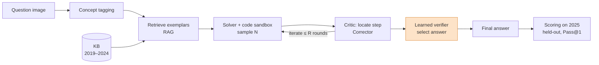

# Phase 1: Proposal and base-paper study

| | |
|---|---|
| **Branch** | `phase-1` |
| **Deliverable** | Statement of Purpose: [`docs/proposal/SOP_12340350_12341940.pdf`](../proposal/SOP_12340350_12341940.pdf) |
| **Base paper** | A. Mukherjee and S. Ghosh, *mmJEE-Eval: A Bilingual Multimodal Benchmark for Evaluating Scientific Reasoning in Vision-Language Models*, Findings of IJCNLP-AACL 2025 ([arXiv:2511.09339](https://arxiv.org/abs/2511.09339), [project page](https://mmjee-eval.github.io)) |
| **Base-paper code** | [`third_party/mmJEE-Eval`](../../third_party/mmJEE-Eval): git submodule of [ArkaMukherjee0/mmJEE-Eval](https://github.com/ArkaMukherjee0/mmJEE-Eval), pinned at commit `815ac89` |
| **Dataset** | Hugging Face [`ArkaMukherjee/mmJEE-Eval`](https://huggingface.co/datasets/ArkaMukherjee/mmJEE-Eval) (MIT license) |

The base-paper repository has no license file, so it is **linked as a submodule, not copied**.
Phase 2 vendors only the scoring functions we are required to reuse, byte for byte and with
attribution (see [`docs/REFERENCES.md`](../REFERENCES.md) on the `phase-2` branch).

---

## 1. Goals

1. Pick a published paper that has code. Find a stated limitation and propose a measurable improvement (course criterion).
2. Study the base paper and its released code. Find what is reusable and what is missing.
3. Write the SOP:
   - problem statement;
   - methodology for four modules;
   - data and resources;
   - a strict year-based train/test protocol;
   - a planned additive evaluation table (Table I) with a compute-matched baseline.
4. Fix the team's division of work.

## 2. Problem statement (from the SOP)

mmJEE-Eval tests 17 VLMs on 1,460 bilingual (English and Hindi) JEE Advanced questions from
2019–2025, covering Physics, Chemistry and Mathematics. The paper reports three findings.

**A capability gap.** On the held-out 2025 set, frontier models reach 77–84%, while open
models reach 37–45%.

**Contamination is not the explanation.** Frontier models lose 2–5% on the unseen 2025 set,
and open models stay roughly the same.

**A metacognition gap.** Models detect an error in their own reasoning in 21–73% of cases,
but fix it in only 1.1–5.2%. The paper evaluates correction in a single pass.

The paper diagnoses these weaknesses but does not try to reduce them. We propose a
**training-free, inference-time framework** around a *frozen* VLM. Only a small verifier is
trained.

| Module | Weakness addressed | Idea |
|---|---|---|
| A. Code-sandbox tool use | Numerical questions (44.7%) need reliable arithmetic | Program-of-Thoughts: calculations run as sandboxed Python/SymPy; CoT fallback |
| B. Agentic iterative correction | Detect-vs-fix gap; single-pass correction | Solver → Critic (finds the *first* wrong step) → Corrector (re-derives from it), at most R rounds |
| C. Learned solution verifier (core ML) | Correction can turn right answers into wrong ones; self-confidence is unreliable | A classifier trained on auto-labelled 2019–2024 solutions selects the best of N candidates |
| D. Retrieval-augmented exemplars | Weak models pick the wrong *method* | Concept tag → retrieve solved 2019–2024 problems with the same method → add them as worked examples |

**Protocol.** Train and develop on 2019–2024. Test only on the contamination-clean 2025 set
(190 questions). Score with the base paper's own functions. Compare against self-consistency
at **matched compute**.

## 3. Base-paper code audit

These findings shaped the Phase-2 design.

| Finding | Consequence for our implementation |
|---|---|
| The repo is an **evaluation harness only** (notebooks, annotation tools, figures). There is no solver, agent or verifier. | All four modules are new code. |
| Answer extraction (`extract_answer`) and scoring (`is_answer_correct`, `calculate_statistics`) exist only as methods inside notebooks (`eval/self-improvement/gemma3_27b_epec.ipynb`, `eval/eval_test_1_acc/acc_test.ipynb`). | The SOP requires reusing them **unchanged**. Phase 2 copies them byte for byte with `scripts/vendor_upstream.py`, and a test re-checks identity against this submodule. |
| The scorer reads the columns `expanded_answer` and `acceptable_values`, which exist only in the authors' private CSV, not in the public HF dataset. | Without them, every Numerical answer scores False. Phase 2 rebuilds the columns on the **data side** (`data/adapter.py`); the scorer stays untouched. |
| The extractor takes the **first** `\boxed{}` and does not handle nested braces. There is no partial credit. | Kept as-is. Our prompts ask for exactly one final `\boxed{}` with a plain number. |
| Metadata issues in the HF release: 12 rows of 2023 P1 typed MCQ-Single but with multi-letter gold answers, 4 duplicated `question_id`s, and 2026 rows added after the paper. | Cleaned and logged in Phase 2 (`data/dataset.py`). 2026 is excluded from the original protocol. |
| The paper's baseline prompts are given in Appendix C (language and question-type instructions). | Copied verbatim into `prompts/templates.py`, with the image before the text, as in the released code. |
| The paper reports Qwen2.5-VL-7B at 12.4 ± 1.9% on 2025. | Used in Phase 2 as a **reproduction check** of our whole harness. |

## 4. Team and division of work (from the SOP)

| Member | Responsibility |
|---|---|
| **Arpit Kumar** (12340350) | Retrieval-Augmented Exemplar Prompting module: knowledge-base construction, retrieval, exemplar injection |
| **Saurav Gupta** (12341940) | Agentic Iterative Correction module: Solver/Critic/Corrector orchestration |
| **Both** | Code-Sandbox Tool Use module and the Learned Solution Verifier: data generation, feature design, training, evaluation |

## 5. Issues encountered in Phase 1

- **The base repo has no reusable solver code**, and the scoring logic lives only in notebooks. We had to decide how to "reuse without changes" (answer: vendor verbatim, then prove identity with a test).
- **The public dataset does not match the paper's private CSV.** The scorer's range and alternative-answer columns are missing.
- **GPU budget.** The only GPU is a shared RTX 3060 (12 GB). So: 4-bit (AWQ) 8B models, one model on the GPU at a time, and a careful compute plan.
- **Fair comparison.** Multi-agent and best-of-N methods use more compute, so the SOP commits to a compute-matched self-consistency baseline.

## 6. Hand-off to Phase 2 (future enhancements at the end of Phase 1)

- Build the harness: data loader and splits, verbatim scorer, vLLM engine with a generation cache.
- Reproduce one paper number before trusting any of our results.
- Implement the four modules. Pilot them on a 40-question stratified subset, then do the full run.
- Report Table I, matched self-consistency, significance tests, and correction statistics comparable to the paper's EP/EC.
