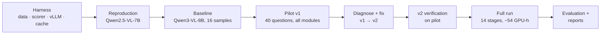

# Phase 2: Baselines, pilot and full run (framework v2)

| | |
|---|---|
| **Branch** | `phase-2` (built on `phase-1`) |
| **Code** | Everything under `src/`, `configs/`, `scripts/`, `tests/` on this branch: the exact code of the full run (v2) |
| **Reports** | [`report/phase2/phase2_report.pdf`](../../report/phase2/phase2_report.pdf) (progress report: baselines, pilot, fixes); [`report/final/final_report.pdf`](../../report/final/final_report.pdf) (draft, full-run results) |
| **Results** | [`results/phase2/`](../../results/phase2) |

---

## 1. Goals

1. Build a reproducible harness: data and splits, the verbatim scorer, a vLLM engine with a generation cache, and resumable stages.
2. **Validate the harness** by reproducing one number from the base paper.
3. Measure the substrate baseline (Qwen3-VL-8B) on our hardware.
4. Implement the four SOP modules, and **pilot** them end to end on 40 questions before spending GPU days.
5. Fix the pilot's failures (v1 → v2). Then run the **full experiment** and fill SOP Table I with a compute-matched self-consistency baseline and significance tests.

## 2. Work done, in order

### 2.1 Baselines on our lab setup (RTX 3060, AWQ 4-bit, vLLM)

| Model | Protocol | 2025 Pass@1 | Paper |
|---|---|---|---|
| Qwen2.5-VL-7B AWQ (reproduction) | Base-paper prompt + scorer, 10 runs | **13.8 ± 1.9** (CI 10.7–17.3) | 12.4 ± 1.9 |
| Qwen3-VL-8B AWQ (our substrate) | Same, 16 samples | **43.4** (CI 37.1–49.9) | — |

The reproduction matches the paper within noise, which validates the harness end to end
(prompts, image handling, extraction, scoring).

On the Qwen3 baseline:
- 40% of samples hit the 4,096-token cap;
- Hindi is 10 points below English;
- diagram questions are 18 points below text-only ones.

### 2.2 Pilot v1 (40 test questions = 20 EN/HI twin pairs, stratified by type)

| Row | Baseline | SC (matched) | PoT | Corr. same | Corr. cross | Verifier | Full |
|---|---|---|---|---|---|---|---|
| Accuracy | 29.5 | 35.0 | 41.2 | 46.6 | 43.1 | 50.0 | 57.5 |

Full vs. SC: +22.5 [+7.5, +37.5]. This is preliminary, on a small subset.

### 2.3 Full run (2025 held-out, 190 questions)

| SOP Table I row | Overall | Numerical | 95% CI | Tokens / question |
|---|---|---|---|---|
| Baseline (single-pass CoT) | 43.2 | 40.2 | 37.0–49.6 | 2.7k |
| Self-consistency (matched compute, n = 20) | 53.2 | 51.2 | 44.2–62.6 | 54.2k |
| + Code sandbox (PoT) | 48.2 | 50.4 | 41.4–54.9 | 3.5k |
| + Agentic correction (same-model critic) | 51.2 | 55.1 | 44.6–58.0 | 6.1k |
| + Agentic correction (cross-model critic) | 51.3 | 53.0 | 44.5–58.1 | 6.4k |
| + Learned verifier | 63.2 | 66.7 | 55.3–71.6 | 51.5k |
| **+ RAG = Full framework** | **65.3** | **69.0** | 57.4–73.7 | 54.1k |

**Main claim:** full framework vs. matched self-consistency = **+12.1 points [+4.2, +20.5]**,
McNemar p = 0.001. 35 questions are right only with the full framework; 12 only with SC.

**Effect of each step:**

| Step | Effect |
|---|---|
| PoT | +5.0 (p = 0.012) |
| Correction | +3.2 [+1.3, +5.0] |
| Verifier | +11.8 [+6.8, +16.6] |
| RAG | +2.1 [−3.2, +6.8] (not significant) |

**Contamination check:** 1 CoT sample per question scores 43.9% on 2019–24 vs. 42.6% on 2025
(Δ −1.3). There is no sign of memorisation.

**Breakdown, full framework:**
- the English–Hindi gap widens from 9.8 to 16.9 points;
- the diagram gap widens from 18.5 to 26.3 points.

So the gains come from reasoning and computation, not from perception.

## 3. Issues encountered and how they were fixed

### 3.1 Pilot findings (v1 → v2)

| # | Observation | Root cause (measured) | Fix |
|---|---|---|---|
| 1 | 47 `NameError`s in executed code | Each code block ran in a fresh process | Earlier blocks are replayed silently as a prelude |
| 2 | 86 code blocks blocked | `scipy.optimize`/`integrate` were not whitelisted | `scipy` allowed (I/O submodules still blocked) |
| 3 | 76 critic replies unparsed (InternVL) | 75/76 hit the 1,536-token cap while re-solving | "Keep your check short" + **verdict forcing** → 500/501 parsed; detection 35 → 56% |
| 4 | CoT fallback in 35–42% of PoT runs | 480/539 hit the token cap while looping without code | A/B tested **answer forcing**: 21.9% vs 30.0% for the SOP fallback, so it was **rejected** (negative result, reported) |
| 5 | Matched SC needed 18 samples; 16 existed | Budget estimate | CoT raised to **20** samples |
| 6 | Verifier ≈ majority vote on the pilot | Small training set | Reported honestly (`primary_beats_majority_on_dev`); the full run uses about 10k solutions |
| 7 | One 12,303-token critic prompt aborted a batch | `VLLMValidationError` is not a `ValueError` | Over-long requests are isolated per request |

### 3.2 Pre-run code review (before any GPU run)

1. GroupKFold positions were used as column labels in verifier CV. Fixed with positional indexing.
2. Verifier features differed between training and test (pool of 16 vs 8, cumulative tokens). Fixed with per-sub-pool features and a per-solution token count.
3. The sandbox read unbounded stdout (8 GB in a test). Output now goes to files capped by `RLIMIT_FSIZE`.
4. Code never ran when the model ended its turn right after a fence. Now detected.
5. There was no context-length guard. Added a per-turn budget and per-request retry.
6. The critic regex took the first match instead of the last. Fixed.
7. `--config` was not passed to the cross-model phase subprocesses. Fixed.
8. CIs ignored the EN/HI twin correlation. Now a cluster bootstrap.
9. The range grid was 0.01 and rejected valid in-range answers. Now 0.001.
10. Duplicate question ids mixed questions in the KB. They now get unique twin keys.
11. The mock VLM was deterministic across images and hid bug 1. Fixed.

### 3.3 Lab and infrastructure

- **KV cache did not fit on 12 GB.** Fixed with `max_pixels` 1.7 MP, `max_num_batched_tokens` 4096 and an **fp8 KV cache**, which also gave 1.9× throughput.
- **flashinfer JIT compile failed** (no `ninja`). Switched to the PyTorch sampler.
- **CUDA OOM at 0.92 memory utilisation.** Now 0.88.
- **vLLM's InternVL processor rejects `max_dynamic_patch`.** Default tiling is used.
- **fp8 KV cache gives garbage with Qwen2.5-VL AWQ** (1.8% accuracy). That model uses the `auto` KV cache, and its cache key was renamed.
- **systemd-oomd killed tmux and `systemd-run --user` jobs during model swaps**, wasting 10.5 h. Jobs now run detached with `nohup setsid` under a retrying supervisor (`scripts/lab/`), and sandbox workers dropped from 8 to 4.
- **rsync exclude patterns were unanchored** and skipped `src/.../report`. Fixed.

## 4. Limitations at the end of Phase 2

- **One substrate model and one exam year:** 190 questions, CIs of about ±6 points.
- **Token budget:** a 4,096-token cap with fp8 weights and cache. About 35% of baseline answers are truncated (the same budget for every configuration).
- **Strict, unchanged scorer:** first `\boxed{}`, no partial credit.
- **Possible pre-training exposure.** Qwen3-VL was released after the 2025 exam, so 2025 may not be fully clean for this model.
- **Verifier selection ≈ majority vote on 2025.** The gain over SC comes mostly from the candidate pool.
- **RAG coverage is low.** Only 30 of 190 test questions retrieve anything.
- **The critic is aggressive.** False alarms reach 19–29%, and 18–39 correct answers were broken per run.

## 5. Future enhancements (input to Phase 3)

1. **A clean test set:** use JEE Advanced 2026 (after every model's cutoff), including Hindi.
2. **A bridge to the paper:** run the framework with Qwen2.5-VL-7B, the model the paper evaluates. Report paper-style **error presence / error correction** (EP/EC) and pass@k.
3. **Memorisation probes:** answer-only and completion-overlap tests per year.
4. **A stronger verifier:** leave-one-year-out model selection, a ranking model, correction-aware features, and a **learned correction-acceptance gate**, so the critic stops breaking correct answers.
5. **Better RAG:** an external source (JEEBench 2016–2018) and hybrid tag + problem-text retrieval with an honestly tuned τ.
6. **Transcript-assisted solving and an adaptive token budget** (continue truncated answers).
