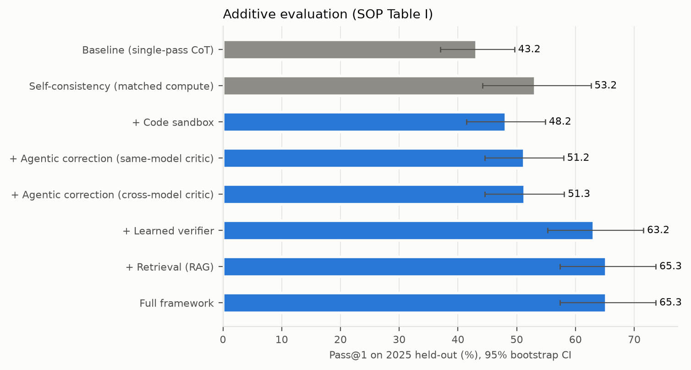
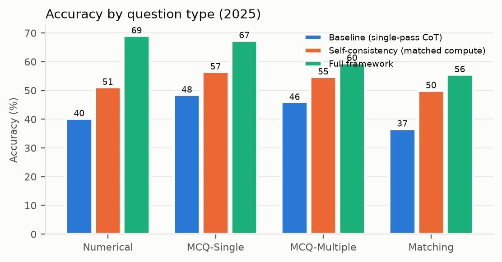
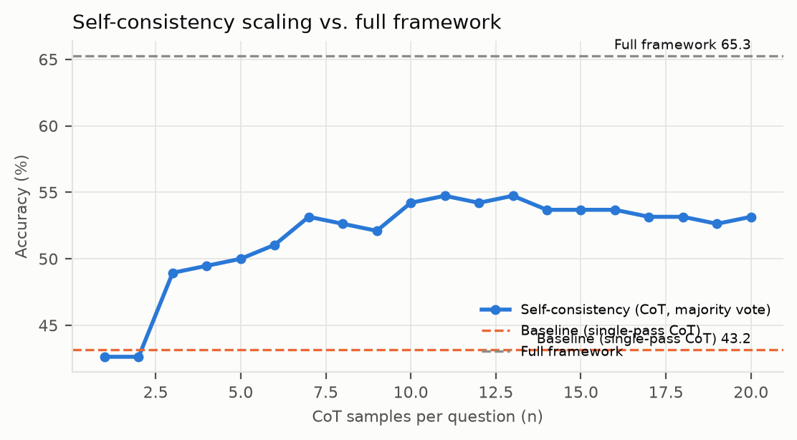
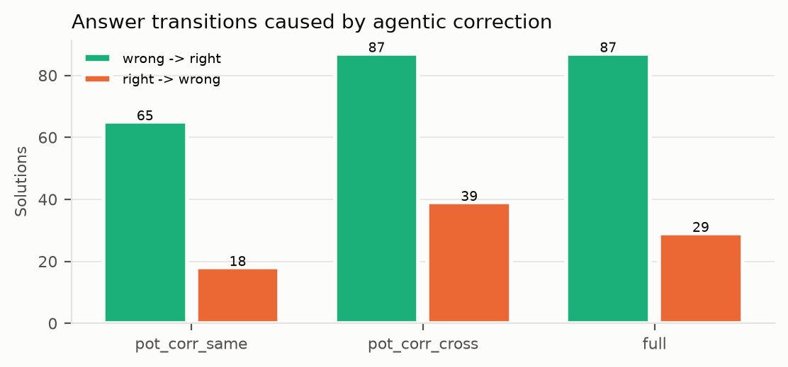
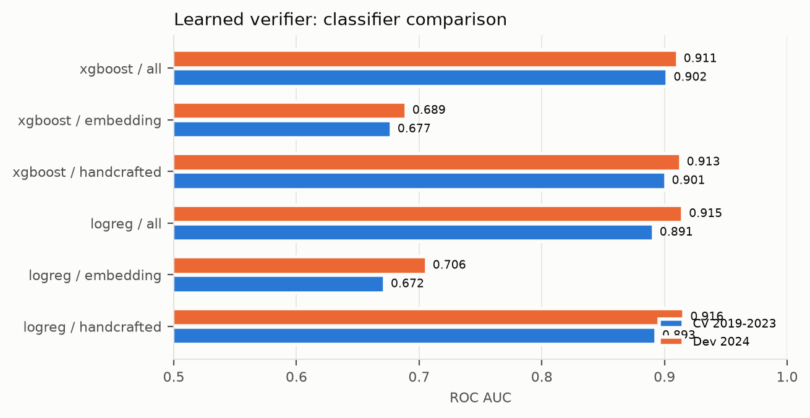

# mmJEE-Reasoner — results report

_Auto-generated by `mmjee report` from `artifacts/`. All accuracies are measured on the 2025 held-out subset (190 questions: 95 English + 95 Hindi) with the base paper's verbatim scoring functions._

## Setup
- Solver / Corrector / tagger: `cyankiwi/Qwen3-VL-8B-Instruct-AWQ-4bit` (frozen, vLLM).
- Cross-model critic: `cyankiwi/InternVL3_5-8B-AWQ-4bit`.
- Sampling: temperature 0.7, top-p 0.8, top-k 20, max 4096 generated tokens per trajectory.
- Correction: ≤3 rounds; stop when the critic finds no error or the answer is unchanged for 2 rounds.
- Verifier pool: 8 PoT samples + their corrected versions; RAG top-2 exemplars.

## Table I — additive evaluation (2025 held-out)
| Configuration | Numerical Acc. | Overall Pass@1 | 95% CI | Δ vs baseline (pts) | Gen. tokens / Q | Calls / Q |
|---|---|---|---|---|---|---|
| Baseline (single-pass CoT) | 40.2 | 43.2 | [37.0, 49.6] | -- | 2709 | 1.0 |
| Self-consistency (matched compute) (n=20) | 51.2 | 53.2 | [44.2, 62.6] | +10.0 [+5.3, +14.6] | 54185 | 20.0 |
| + Code sandbox | 50.4 | 48.2 | [41.4, 54.9] | +5.0 [+0.4, +9.8] | 3511 | 1.9 |
| + Agentic correction (same-model critic) | 55.1 | 51.2 | [44.6, 58.0] | +8.1 [+3.3, +13.1] | 6126 | 4.4 |
| + Agentic correction (cross-model critic) | 53.0 | 51.3 | [44.5, 58.1] | +8.2 [+3.5, +13.4] | 6439 | 4.7 |
| + Learned verifier | 66.7 | 63.2 | [55.3, 71.6] | +20.0 [+13.4, +27.0] | 51512 | 37.6 |
| + Retrieval (RAG) | 69.0 | 65.3 | [57.4, 73.7] | +22.1 [+16.1, +28.5] | 54134 | 39.2 |
| Full framework | 69.0 | 65.3 | [57.4, 73.7] | +22.1 [+16.1, +28.5] | 54134 | 39.2 |

Full framework vs. compute-matched self-consistency: +12.1 points (95% CI [+4.2, +20.5]; McNemar p = 0.001).

## Breakdown by question type
| Configuration | MCQ-Multiple | MCQ-Single | Matching | Numerical |
|---|---|---|---|---|
| Baseline (single-pass CoT) | 46.0 | 48.5 | 36.7 | 40.2 |
| Self-consistency (matched compute) | 54.8 | 56.5 | 50.0 | 51.2 |
| + Code sandbox | 44.9 | 51.9 | 35.4 | 50.4 |
| + Agentic correction (same-model critic) | 46.4 | 52.7 | 41.0 | 55.1 |
| + Agentic correction (cross-model critic) | 47.6 | 55.2 | 42.4 | 53.0 |
| + Learned verifier | 54.8 | 65.2 | 61.1 | 66.7 |
| + Retrieval (RAG) | 59.5 | 67.4 | 55.6 | 69.0 |
| Full framework | 59.5 | 67.4 | 55.6 | 69.0 |

## Breakdown by language
| Configuration | English | Hindi |
|---|---|---|
| Baseline (single-pass CoT) | 48.1 | 38.3 |
| Self-consistency (matched compute) | 57.9 | 48.4 |
| + Code sandbox | 54.7 | 41.6 |
| + Agentic correction (same-model critic) | 58.0 | 44.5 |
| + Agentic correction (cross-model critic) | 58.8 | 43.8 |
| + Learned verifier | 72.6 | 53.7 |
| + Retrieval (RAG) | 73.7 | 56.8 |
| Full framework | 73.7 | 56.8 |

## Breakdown by subject
| Configuration | Chemistry | Mathematics | Physics |
|---|---|---|---|
| Baseline (single-pass CoT) | 41.6 | 53.9 | 33.6 |
| Self-consistency (matched compute) | 48.4 | 70.3 | 40.3 |
| + Code sandbox | 42.4 | 64.6 | 37.1 |
| + Agentic correction (same-model critic) | 44.7 | 68.8 | 39.9 |
| + Agentic correction (cross-model critic) | 44.5 | 71.1 | 37.9 |
| + Learned verifier | 57.8 | 76.6 | 54.8 |
| + Retrieval (RAG) | 60.9 | 79.7 | 54.8 |
| Full framework | 60.9 | 79.7 | 54.8 |

## Self-consistency curve (CoT)
n=1: 42.6, n=2: 42.6, n=3: 48.9, n=4: 49.5, n=5: 50.0, n=6: 51.1, n=7: 53.2, n=8: 52.6, n=9: 52.1, n=10: 54.2, n=11: 54.7, n=12: 54.2, n=13: 54.7, n=14: 53.7, n=15: 53.7, n=16: 53.7, n=17: 53.2, n=18: 53.2, n=19: 52.6, n=20: 53.2

## Agentic correction analysis
| Run | Acc. before | Acc. after | Detect (wrong flagged) | False alarm | Fix rate of detected | wrong→right | right→wrong | Mean rounds |
|---|---|---|---|---|---|---|---|---|
| pot_corr_same | 48.2 | 51.2 | 57.9 | 19.3 | 14.3 | 65 | 18 | 1.47 |
| pot_corr_cross | 48.2 | 51.3 | 59.3 | 25.7 | 18.6 | 87 | 39 | 1.53 |
| full | 50.9 | 54.7 | 60.7 | 28.6 | 19.2 | 87 | 29 | 1.53 |

## Learned verifier
Training data: 10160 solutions of 1270 questions (2019–2024), positive rate 0.455.

| Model | Features | CV AUC | CV AP | CV F1 | Dev AUC | Dev F1 | Dev sel. (max-prob) | Dev sel. (weighted vote) |
|---|---|---|---|---|---|---|---|---|
| logreg | handcrafted | 0.893 | 0.877 | 0.796 | 0.916 | 0.844 | 60.3 | 61.3 |
| logreg | embedding | 0.672 | 0.599 | 0.641 | 0.706 | 0.698 | 50.0 | 59.3 |
| logreg | all | 0.891 | 0.875 | 0.794 | 0.915 | 0.847 | 61.8 | 61.8 |
| xgboost | handcrafted | 0.901 | 0.887 | 0.801 | 0.913 | 0.831 | 59.3 | 60.3 |
| xgboost | embedding | 0.677 | 0.599 | 0.646 | 0.689 | 0.687 | 51.5 | 57.8 |
| xgboost | all | 0.902 | 0.891 | 0.804 | 0.911 | 0.819 | 59.8 | 61.3 |

Dev (2024) selection baselines: majority vote 59.3%, random pick 50.2%, oracle (any correct) 77.0%.
Primary configuration (chosen on dev only): **logreg / all / max_prob**.

Top features of the primary model: `emb_pc2` (2.289), `emb_pc24` (1.852), `emb_pc19` (1.813), `agree_frac` (1.719), `log_tokens` (1.718), `valid_format` (1.443), `emb_pc7` (1.366), `emb_pc21` (1.295), `emb_pc25` (1.107), `emb_pc28` (1.098)

**2025 pool `pot`** (reported only; not used for any choice): majority vote 60.5%, oracle 78.9%.

| Variant | AUC | AP | F1 | Sel. max-prob | Sel. weighted vote |
|---|---|---|---|---|---|
| logreg/handcrafted | 0.836 | 0.839 | 0.755 | 60.5 | 61.1 |
| logreg/embedding | 0.655 | 0.656 | 0.651 | 52.6 | 60.5 |
| logreg/all | 0.834 | 0.835 | 0.767 | 61.6 | 61.6 |
| xgboost/handcrafted | 0.880 | 0.878 | 0.768 | 62.6 | 63.2 |
| xgboost/embedding | 0.663 | 0.644 | 0.657 | 53.2 | 61.1 |
| xgboost/all | 0.884 | 0.878 | 0.805 | 65.3 | 65.3 |

**2025 pool `pot_corr_cross`** (reported only; not used for any choice): majority vote 61.6%, oracle 82.6%.

| Variant | AUC | AP | F1 | Sel. max-prob | Sel. weighted vote |
|---|---|---|---|---|---|
| logreg/handcrafted | 0.827 | 0.835 | 0.753 | 63.7 | 63.2 |
| logreg/embedding | 0.662 | 0.670 | 0.668 | 54.2 | 61.6 |
| logreg/all | 0.828 | 0.833 | 0.767 | 63.2 | 63.2 |
| xgboost/handcrafted | 0.874 | 0.879 | 0.770 | 63.2 | 64.7 |
| xgboost/embedding | 0.669 | 0.658 | 0.673 | 54.7 | 62.1 |
| xgboost/all | 0.881 | 0.881 | 0.809 | 66.8 | 64.7 |

**2025 pool `full`** (reported only; not used for any choice): majority vote 65.8%, oracle 85.3%.

| Variant | AUC | AP | F1 | Sel. max-prob | Sel. weighted vote |
|---|---|---|---|---|---|
| logreg/handcrafted | 0.838 | 0.864 | 0.776 | 64.2 | 64.7 |
| logreg/embedding | 0.652 | 0.684 | 0.688 | 59.5 | 64.7 |
| logreg/all | 0.836 | 0.860 | 0.774 | 65.3 | 66.8 |
| xgboost/handcrafted | 0.889 | 0.904 | 0.802 | 67.4 | 67.9 |
| xgboost/embedding | 0.640 | 0.654 | 0.694 | 52.1 | 65.3 |
| xgboost/all | 0.882 | 0.896 | 0.815 | 67.9 | 67.9 |

## Retrieval knowledge base
KB entries: 454 (of 635 training questions; 180 had no verified-correct solution; 1 removed as near-duplicates of 2025 questions). Similarity threshold τ = 0.885 (auto-proxy; dev coverage 16.7%, proxy precision 70.6% vs. base 31.4%).

## Contamination check (paper Table 7 protocol)
Baseline CoT, 1 sample: 2019–2024 = 43.9% (n=1270), 2025 = 42.6% (n=190); Δ = -1.3 points. By year: 2019: 44.0, 2020: 47.2, 2021: 43.4, 2022: 31.4, 2023: 49.5, 2024: 48.5

## Reproduction check (base paper protocol)
`Qwen/Qwen2.5-VL-7B-Instruct-AWQ` with the paper's verbatim prompt and scorer: Pass@1 **13.8 ± 1.9%** over 10 runs (95% CI [10.7, 17.3]); the paper reports 12.4 ± 1.9% (Table 3, 2025 set). Differences can come from 4-bit AWQ weights and unreported sampling settings.

RAG-PoT without correction/verifier (mean over samples): 50.9%.

## Data notes
- Split sizes: {'train': 1270, 'test': 190, 'excluded': 102}.
- Numerical golds expanded for the scorer (ranges / alternatives): 107.
- Retyped MCQ-Single → MCQ-Multiple (metadata error): 12 rows.
- Duplicate question ids disambiguated: ['2023_P2_Hindi_Mathematics_Numerical_q1_Numerical_page5', '2023_P2_Hindi_Mathematics_Numerical_q2_Numerical_page5', '2023_P2_Hindi_Mathematics_Numerical_q3_Numerical_page5', '2023_P2_Hindi_Mathematics_Numerical_q4_Numerical_page5'].

## Figures

