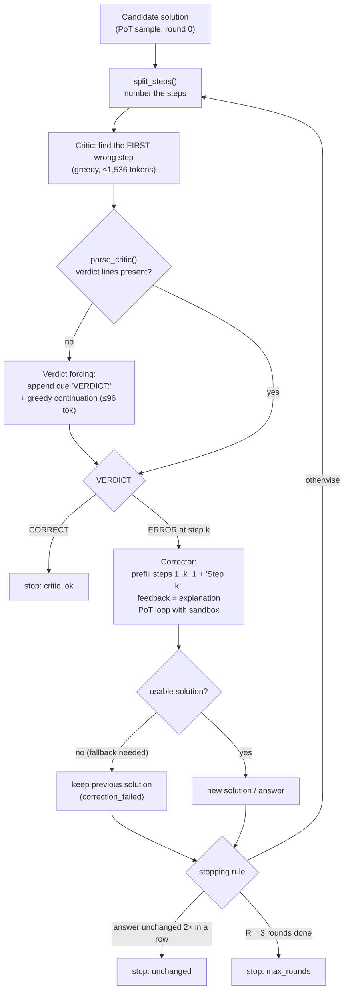

# Module B: Agentic Iterative Correction (`agents/`)

**Owner:** Saurav Gupta (SOP §I). Driver stage: [`pipeline/correct.py`](../pipeline/correct.py).

The base paper evaluates error correction in **one pass**. It finds that models detect errors
in 21–73% of cases but fix only 1.1–5.2%. This module turns correction into an **iterative,
multi-agent loop** that works at the level of individual steps.

## Roles

| Role | Model | Input | Output |
|---|---|---|---|
| **Solver** | Qwen3-VL-8B (frozen) + code sandbox | question image + PoT prompt | numbered solution with `\boxed{}` answer |
| **Critic** | same model (`critic: solver`) **or** InternVL3.5-8B (`critic: critic_cross`) | image + question-type instructions + numbered steps | `VERDICT`, `FIRST_ERROR_STEP`, `EXPLANATION` |
| **Corrector** | Solver VLM + code sandbox | steps 1..k−1 kept as a *prefilled* answer, plus the critic's explanation | re-derived solution from step k onward |

## One correction chain

**Stopping rule** (`configs/base.yaml → correction`):
- the critic finds no error; **or**
- the answer stays the same for `unchanged_patience = 2` consecutive rounds; **or**
- `max_rounds = 3` rounds have run.

## Files

| File | Contents |
|---|---|
| `steps.py` | `split_steps` splits on "Step k" markers outside code fences, falling back to paragraphs. `number_steps` renders the steps. `parse_critic` reads the *last* verdict / step / explanation lines. |
| `loop.py` | The `Chain` dataclass (solutions, critiques, stop reason). `critic_phase` and `corrector_phase` each run one batched phase over all open chains. `run_correction_inprocess` is used for the same-model critic. `save_chains`/`load_chains` persist the chains between phases. |

## Design decisions

- **Phases persist to disk.** Each round is split into a critic phase and a corrector phase that work on a saved `chains.json`. With a cross-model critic, every phase runs in a **fresh subprocess** (`mmjee phase ...`), so only one 8B model sits on the 12 GB GPU at a time.
- **Locate, don't just judge.** The critic must name the *first* wrong step, not give a yes/no verdict. The corrector keeps the accepted prefix, so each round is cheaper and better targeted than re-solving from scratch.
- **Verdict forcing (pilot fix, v1 → v2).** In the pilot, 76 InternVL critic replies could not be parsed. 75 of them had hit the token cap while re-solving the problem. Two fixes: a "keep your check short" instruction, and one short greedy continuation after the cue `VERDICT:`. Parsed replies rose from 244/320 to 500/501.
- **Conservative failure handling.** If a corrector attempt produces no usable solution, the previous solution is kept. An over-long critic prompt is isolated per request and treated as "no error found".
- **Cross-model critic.** The SOP recommends a different model family to reduce shared blind spots. Both settings are reported.

## Results (2025 held-out, 190 questions × 8 chains = 1,520 chains per run)

| Run | Accuracy before → after | Detection (wrong originals flagged) | False alarms (correct originals flagged) | Fixed among detected | Wrong→right / right→wrong | Mean rounds |
|---|---|---|---|---|---|---|
| `pot_corr_same`, same-model critic | 48.2 → 51.2 | 57.9% | 19.3% | 14.3% | 65 / 18 | 1.47 |
| `pot_corr_cross`, cross-model critic (InternVL) | 48.2 → 51.3 | 59.3% | 25.7% | 18.6% | 87 / 39 | 1.53 |
| `full`, cross-model critic on RAG-PoT | 50.9 → 54.7 | 60.7% | 28.6% | 19.2% | 87 / 29 | 1.53 |

Across all three runs only 1 critic reply stayed unparsed (after verdict forcing). Source: `correction` in
[`results/phase2/results.json`](../../../results/phase2/results.json).

The paper's single-pass fix rate is 1.1–5.2%. The correction step adds +3.2 points [+1.3, +5.0].

## References

- A. Madaan et al., *Self-Refine: Iterative Refinement with Self-Feedback*, NeurIPS 2023. This is the iterative feedback/refine loop the module follows.
- A. Mukherjee and S. Ghosh, *mmJEE-Eval*, Findings of IJCNLP-AACL 2025, §metacognition (single-pass EP/EC numbers we compare against).
- Critic and corrector prompts: [`prompts/templates.py`](../prompts/templates.py) (`CRITIC_PROMPT`, `CRITIC_VERDICT_CUE`, `CORRECTOR_FEEDBACK`).
