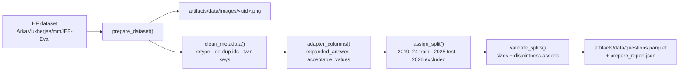

# Data loading, cleaning and splits (`data/`)

## Flow

## Files

| File | Contents |
|---|---|
| `dataset.py` | `prepare_dataset` downloads once, then writes the images and the metadata table. `parse_question_id` / `twin_key` give the English and Hindi versions one shared key, which groups splits, CV folds and KB entries. `clean_metadata`, `validate_splits`, and `load_questions(cfg, split, limit)`, which every later stage uses. |
| `adapter.py` | Data-side adapter for the verbatim upstream scorer (below). |

## Split (SOP §IV-A)

- **train/dev:** 2019–2024, 1,270 questions. The dev year for model selection is 2024.
- **test:** 2025, 190 questions (95 English + 95 Hindi twins). Results are reported only on this set.
- **2026** rows, added to the HF release after the paper, are excluded in phases 1–2.

## Data fixes (logged in `prepare_report.json`)

| Issue in the public release | Fix |
|---|---|
| The scorer reads `expanded_answer`/`acceptable_values`, which exist only in the authors' private CSV | `adapter.py` rebuilds them. Range golds ("8.70 TO 9.10") are expanded on a 0.001 grid, and alternatives ("80 OR 150 OR 220") are unioned. Without this, every Numerical answer scores False. **The scoring functions stay untouched.** |
| 12 rows of 2023 P1 (6 EN + 6 HI) are typed MCQ-Single but have multi-letter golds | Retyped as MCQ-Multiple (their ids say MCQ-Multiple) |
| 4 duplicated `question_id`s that are different questions | `__dupN` suffix and their own twin key |

Published report: [`results/phase2/prepare_report.json`](../../../results/phase2/prepare_report.json).
