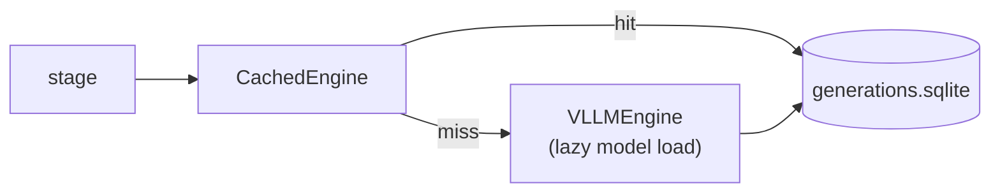

# Inference engines and generation cache (`llm/`)

| File | Contents |
|---|---|
| `types.py` | `GenRequest` / `GenResult`; message helpers (`user_message`, `assistant_message`); `derive_seed`. |
| `engine.py` | `VLLMEngine` runs offline batched `LLM.chat` with vLLM. It supports `continue_final_message` for the PoT and verdict-forcing continuations, and isolates over-long requests one by one. `MockEngine` gives scripted replies. `CachedEngine` wraps an engine with the cache; the model is **loaded only on a cache miss**. |
| `cache.py` | `GenerationCache`: SQLite store keyed by `sha256(model, messages, sampling)`. |
| `mock.py` | `FakeVLM`: deterministic fake VLM for tests and `--mock` dry runs. It recognises each prompt type and is right with a fixed probability. |
| `__init__.py` | `make_engine(cfg, role)`: builds the cached engine for a model role (`solver`, `critic_cross`, `repro`). |

## Reproducibility

- Seeds are derived from `(seed, mode, question, sample, turn)`. Raising N therefore reuses the earlier samples.
- Every completion is cached, so `evaluate` and `report` run fully offline.

## GPU constraints (RTX 3060, 12 GB)

- One model is on the GPU at a time. The cross-model critic phases run as separate processes.
- `kv_cache_dtype: fp8` gave 1.9× KV capacity.
- `max_num_batched_tokens: 4096` and `max_pixels: 1.7 MP` keep the encoder and profiling memory small.
- **Qwen2.5-VL AWQ produces garbage with an fp8 KV cache**, so the `repro` role uses `auto`. Its cache entries were invalidated by renaming the model.

All settings are in [`configs/models.yaml`](../../../configs/models.yaml).
