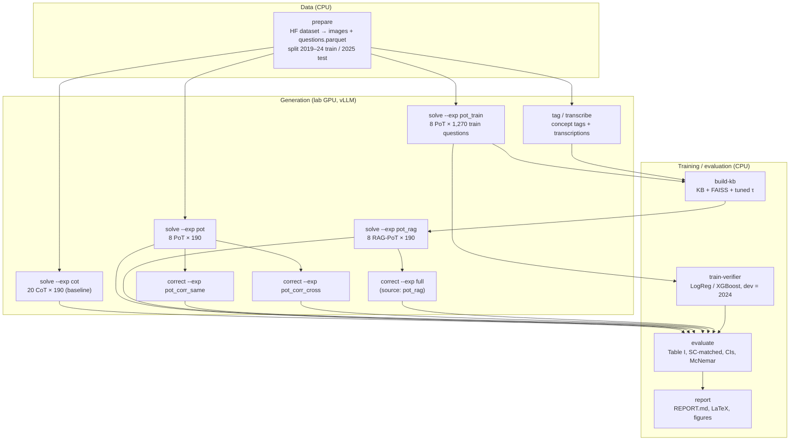

# Pipeline stages (`pipeline/`)

The stage drivers behind `python -m mmjee_reasoner <stage>` (see [`cli.py`](../cli.py)). Each
stage reads and writes files under `artifacts/`. Every model call and code execution is cached
in `artifacts/cache/generations.sqlite`, so all stages can be **resumed**: a re-run computes
only what is missing.

## End-to-end flow

## Files

| File | Stage(s) | What it does |
|---|---|---|
| `common.py` | all | Experiment and candidate paths, JSONL I/O, question selection. Selection supports the full set, `--limit N` (random smoke subset) and `--pilot` (fixed, stratified twin-pair subset: 20 test pairs / 75 train pairs). Also `score_into`, which scores every record with the upstream scorer at generation time. |
| `solve.py` | `solve` | `solve_cot`: base-paper prompt, N independent samples. `solve_pot`: PoT loop with sandbox, CoT fallback, and optional RAG exemplars. Writes `generations/<exp>/candidates.jsonl`. |
| `correct.py` | `correct`, `phase` | Builds one chain per source candidate and runs critic and corrector phases (in-process for a same-model critic, one subprocess per phase for a cross-model critic). Then writes the corrected candidates. |
| `evaluate.py` | `evaluate` | Works offline from candidate files. Computes SOP Table I, self-consistency at matched compute, breakdowns, cluster-bootstrap CIs, paired tests, correction statistics, the verifier on 2025, contamination, and the reproduction check. |

## Table I row kinds (`configs/base.yaml → eval.table1`)

| Kind | Meaning |
|---|---|
| `mean` | **Pass@1** = mean correctness over the N samples (one "run" per sample index, as the base paper averages k runs) |
| `sc_matched` | **Self-consistency at matched compute**: majority vote over the first *n* CoT samples, *n* = ⌈full-framework generated tokens per question / CoT tokens per sample⌉ (n = 20 in the full run) |
| `verifier` | Best-of-N with the learned verifier over {8 original PoT samples} ∪ {their 8 corrected versions} |

**Statistics:**
- 95% CIs come from a **cluster bootstrap over English/Hindi twin pairs** (95 clusters, 2,000 resamples).
- Paired differences use a paired bootstrap; full vs. SC also uses **McNemar's test**.

## Experiments (`configs/experiments/*.yaml`)

| Experiment | Kind | Purpose |
|---|---|---|
| `cot` | solve, CoT, test, 20 samples | Baseline and the SC pool |
| `pot` | solve, PoT, test, 8 | + Code sandbox |
| `pot_train` | solve, PoT, train, 8 | Verifier training data and KB solutions |
| `cot_train` | solve, CoT, train, 1 | Contamination check (2019–24 vs 2025) |
| `pot_rag` | solve, PoT + RAG, test, 8 | RAG effect on PoT |
| `pot_corr_same` / `pot_corr_cross` | correct (source `pot`) | + Agentic correction |
| `full` | correct (source `pot_rag`, cross critic) | Full framework pool |
| `repro_qwen25` | solve, CoT, test, 10, model `repro` | Reproduction of the paper's Qwen2.5-VL-7B number |
