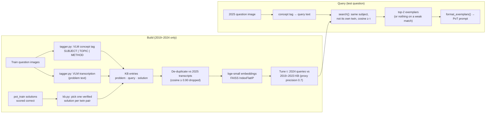

# Module D: Retrieval-Augmented Exemplar Prompting (`rag/`)

Weaker models often fail at **choosing a solution method**, not at recalling formulas. So
instead of retrieving formulas, the module retrieves **previously solved problems that use the
same method** and adds them to the prompt as worked examples. They serve as guidance on
method, not as answers to copy.

## Build and query

## Files

| File | Contents |
|---|---|
| `tagger.py` | Concept tagging and transcription with the Solver VLM (greedy decoding). Tagging the image avoids relying on raw OCR, and gives English text for Hindi questions too. `parse_tag` falls back to the raw text if the format is missed. |
| `kb.py` | `build_entries`: one entry per exam question (English/Hindi twins merged), using a solution generated by the Solver on the *training* questions and verified correct by the upstream scorer. There are no human solutions. `dedup_against_test` removes leakage. `build_kb` writes `artifacts/rag/kb/{kb.jsonl, index.faiss, meta.json}`. |
| `retrieve.py` | `search`: cosine top-k with subject filter, own-twin exclusion and threshold. `tune_threshold`: τ is the smallest similarity at which top-1 *proxy precision* (topic token Jaccard ≥ 0.5) reaches `proxy_precision_target`. `exemplars_for_questions` feeds the solve stage. |

## Leakage control

- Only train-split (2019–2024) questions enter the KB.
- An entry is dropped if its transcription is a near-duplicate (cosine ≥ 0.90) of any 2025 transcription.
- 2025 transcriptions are used **only** for this de-duplication.
- τ is tuned using only training years.
- The learned verifier acts as a safety net if a retrieved exemplar misleads the solver.

## Phase-2 numbers

| | Value |
|---|---|
| Training twin pairs | 635 |
| Without any correct solution | 180 |
| Dropped by de-duplication | 1 (cosine 0.935) |
| **KB entries** | **454** |
| Tuned τ | 0.885: dev coverage 16.7%, proxy precision 0.71 (base 0.31) |
| 2025 questions that retrieved exemplars | 30 / 190 |
| RAG-PoT vs PoT (all 190) | 50.9 vs 48.2 |
| On the 30 retrieved questions | 30.0 → 37.9 |
| RAG step in Table I | +2.1 [−3.2, +6.8], not significant |

Source: [`results/phase2/kb_meta.json`](../../../results/phase2/kb_meta.json).

**Main limitation:** coverage. Most test questions find no exemplar above τ. Phase 3 studies
other sources (JEEBench) and hybrid retrieval.

## References

- P. Lewis et al., *Retrieval-Augmented Generation for Knowledge-Intensive NLP Tasks*, NeurIPS 2020.
- J. Johnson, M. Douze and H. Jégou, *Billion-scale similarity search with GPUs* (FAISS), IEEE Trans. Big Data 2019.
- Embedding model: [`BAAI/bge-small-en-v1.5`](https://huggingface.co/BAAI/bge-small-en-v1.5).
- Tagger, transcriber and exemplar prompts: [`prompts/templates.py`](../prompts/templates.py) (`TAGGER_PROMPT`, `TRANSCRIBE_PROMPT`, `EXEMPLAR_HEADER`).
