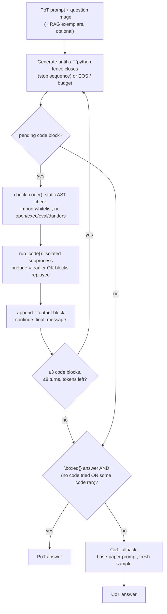

# Module A: Code-Sandbox Tool Use (`sandbox/`)

Numerical questions are the largest category (44.7%) and need reliable calculation, where
VLMs often make arithmetic slips. Following **Program-of-Thoughts**, the model reasons in
natural language but writes every calculation as Python/SymPy. The code is **executed in a
sandbox**, and its real output is fed back to the model before it continues.

## PoT loop (`pot.py`)

- All trajectories of a stage advance **together**: one batched vLLM call per turn.
- The fallback follows SOP III-A. If there is no `\boxed{}` answer, or code was attempted but never ran, the question is answered with plain CoT. So the module should not score below the baseline.
- `force_answers` (budget forcing) exists but is **off** (`sandbox.force_answer: false`). In a pilot A/B it scored 21.9% vs 30.0% for the SOP CoT fallback. This negative result is reported.

## Executor safety (`executor.py`)

Defence in depth for untrusted, model-written code:

1. **Static check (`ast`).** Only whitelisted top-level modules can be imported: `math, cmath, fractions, decimal, itertools, functools, statistics, sympy, numpy, scipy, collections, operator`. File-I/O and parser submodules (`scipy.io`, `sympy.parsing`, …) stay blocked. `open/exec/eval/compile/__import__/input/globals` and any dunder attribute access are rejected.
2. **Isolated subprocess.** The code runs under `python -I` in a temporary directory with an empty environment.
3. **POSIX limits.** CPU time, address space (1,024 MB), no core files, and a file-size cap. stdout and stderr go to files, so output size is capped too.
4. **Wall-clock timeout** (10 s). The whole process group is killed when it expires.

This guards against accidents, not against a determined attacker (there is no network
namespace).

- `ExecCache` stores every result in SQLite, so re-runs are deterministic.
- `run_many` runs blocks in parallel (`workers: 4`).

## Pilot-driven fixes (v1 → v2)

| Observation (40-question pilot) | Fix |
|---|---|
| 47 `NameError`s: each block ran in a fresh process, but the model reuses variables | Earlier successful blocks of the same solution are **replayed silently** as a prelude |
| 86 blocks blocked: `scipy.optimize`/`scipy.integrate` were not whitelisted | `scipy` allowed (I/O submodules still blocked) |
| Unbounded stdout read into the parent process (8 GB in a test) | Output to files capped by `RLIMIT_FSIZE` |
| The model ended its turn right after a code fence, so the code never ran | Detected (`pending_python_block`) and executed |

## Results (2025 held-out)

- PoT: **48.2%** vs 43.2% for baseline CoT (+5.0, McNemar p = 0.012). Numerical questions: 40.2 → 50.4.
- Trajectory anatomy:

  | Trajectory type | Share | Accuracy |
  |---|---|---|
  | Ran code | 26% | 61% |
  | Answered without code | 38% | 57% |
  | Fell back to CoT | 36% | 30% |

  The 4,096-token cap is the main remaining loss.

## References

- W. Chen, X. Ma, X. Wang and W. W. Cohen, *Program of Thoughts Prompting: Disentangling Computation from Reasoning for Numerical Reasoning Tasks*, TMLR 2023.
- PoT prompt and output template: [`prompts/templates.py`](../prompts/templates.py) (`POT_INSTRUCTIONS`, `CODE_OUTPUT_TEMPLATE`).
