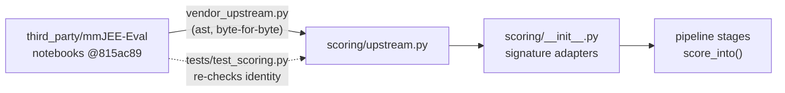

# Answer extraction, scoring and metrics (`scoring/`)

Every correctness decision in this project goes through the **base paper's own functions,
copied verbatim**.

| File | Contents |
|---|---|
| `upstream.py` | **Verbatim** (byte-identical) copies of the base-paper functions: • `extract_answer`, from `eval/self-improvement/gemma3_27b_epec.ipynb`; • `is_answer_correct` and `calculate_statistics`, from `eval/eval_test_1_acc/acc_test.ipynb`. Source: [ArkaMukherjee0/mmJEE-Eval](https://github.com/ArkaMukherjee0/mmJEE-Eval) @ `815ac89`. The file is generated by [`scripts/vendor_upstream.py`](../../../scripts/vendor_upstream.py) and excluded from linting. |
| `__init__.py` | Thin signature adapters: `extract_answer`, `is_correct`, `score_response`, `calculate_statistics`. They pass plain dicts instead of `pd.Series`. |
| `metrics.py` | Pass@1 (mean of per-run accuracies, via the upstream `calculate_statistics`); cluster bootstrap CIs over EN/HI twins; paired bootstrap; McNemar; breakdowns by type, language, subject and diagram. |

**Identity guarantee.** `tests/test_scoring.py` re-extracts the functions from the submodule's
notebooks and asserts that they are identical to `upstream.py`. It also checks that every gold
answer in the dataset scores as correct.

## Upstream behaviour kept as-is

- The extractor takes the **first** `\boxed{}` and does not handle nested braces.
- There is no partial credit.

Our module prompts therefore ask for exactly one final `\boxed{}` with a plain decimal number.
