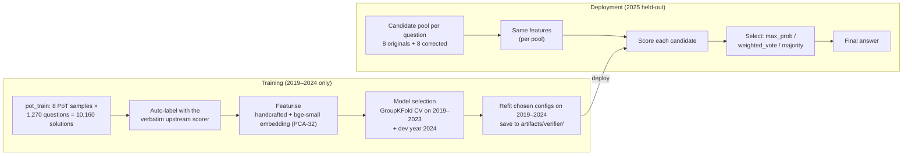

# Module C: Learned Solution Verifier (`verifier/`), the core ML component

This is the only trained component. A classifier predicts **P(candidate solution is correct)**
and selects the final answer from a pool of N candidates (best-of-N). Self-selection and plain
majority voting are not reliable, because correction can also turn right answers into wrong
ones.

## Training vs. deployment

## Features (`features.py`)

| Group | Features |
|---|---|
| Trace | log chars, log tokens of *this* trajectory, #steps, #code blocks / OK / errors, code-OK fraction, CoT fallback used, truncated (`finish == length`), #`\boxed`, hedging phrases per 1k chars |
| Answer | format valid for the question type, is a number, log \|value\|, is an integer, is negative, #decimals, #option letters |
| Pool (self-consistency signal) | share of *other* candidates with the same normalised answer (`agree_frac`), majority flag, #distinct answers |
| Metadata | question type, subject, language (Hindi), diagram required |
| Embedding (optional set) | `BAAI/bge-small-en-v1.5` embedding of the last 2,000 characters of the solution, reduced by PCA to 32 dimensions (fit on training data only) |

`answer_key` normalises answers for voting and agreement ("2.50" = "2.5"; "BA" = "AB").

## Models and selection (`model.py`, `train.py`)

- **Models:** logistic regression and XGBoost. Feature sets: `handcrafted`, `embedding`, `all`. Class imbalance is handled with `class_weight="balanced"` (LogReg) and `scale_pos_weight` (XGBoost).
- **Protocol** (no 2025 data is touched):
  1. GroupKFold (5 folds) on 2019–2023. Groups are twin keys, so the English and Hindi versions of a question never fall on both sides. This gives OOF AUC/AP and the F1-optimal threshold.
  2. Fit on 2019–2023 and evaluate on the **2024 dev year**: AUC/AP/F1, plus best-of-N selection accuracy versus majority vote.
  3. The primary configuration (model, feature set, selection rule) is the one with the best dev selection accuracy. Ties go to the higher dev AUC.
  4. Refit every configuration on all of 2019–2024 and save it.
- **Selection rules** (`select`):
  - `max_prob`: the single highest-scoring candidate;
  - `weighted_vote`: sum of scores per normalised answer;
  - `majority`;
  - `oracle` and `random_expected`, as reference bounds.

## Results (phase 2)

| | Value |
|---|---|
| Training solutions | 10,160 (45.5% correct) |
| Primary (chosen on 2024 dev) | LogReg / all features / max_prob: dev AUC 0.915 |
| 2025 AUC (reported, never used for choices) | LogReg/all 0.836 · XGBoost/all 0.882 |
| Verifier step in Table I | **+11.8 [+6.8, +16.6]** points |
| 2025 full pool: primary selector / majority / oracle | 65.3 / 65.8 / 85.3 |

**Honest finding.** On the 2025 full pool, the selector is about equal to majority vote. Most
of the gain over self-consistency comes from the **diverse candidate pool** (originals plus
corrected versions), not from the selector. On the 2024 dev year the primary selector did
beat majority vote (61.8 vs 59.3).

Full metrics: [`results/phase2/verifier_report.json`](../../../results/phase2/verifier_report.json).

## References

- K. Cobbe et al., *Training Verifiers to Solve Math Word Problems*, arXiv:2110.14168, 2021 (trained outcome verifiers for best-of-N).
- X. Wang et al., *Self-Consistency Improves Chain of Thought Reasoning*, ICLR 2023 (sibling-agreement features; majority-vote baseline).
- T. Chen and C. Guestrin, *XGBoost*, KDD 2016.
- S. Xiao et al., *C-Pack: Packaged Resources To Advance General Chinese Embedding* (BGE models), arXiv:2309.07597. Model card: [`BAAI/bge-small-en-v1.5`](https://huggingface.co/BAAI/bge-small-en-v1.5).
